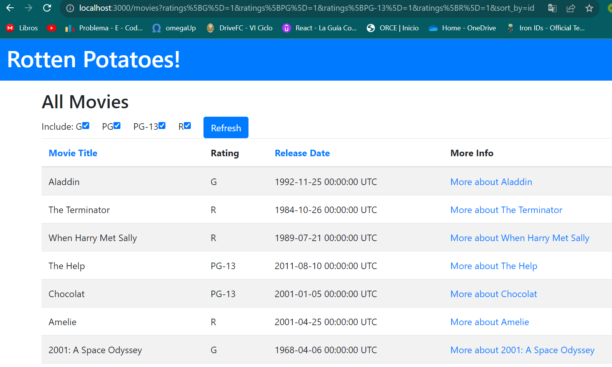

### Practica Calificada 5
## Preguntas:  En este conjunto de preguntas tus respuestas deben ir de acuerdo a las actividades correspondientes, no se puntúa sino hay evidencia del uso de los scripts desarrollados y solo presentas respuestas sin evidencia de lo desarrollado a lo largo del curso. (7 puntos)

## 1.	En las actividades relacionados a la Introducción de Rails los métodos actuales del controlador no son muy robustos: si el usuario introduce de manera manual un URI para ver (Show) una película que no existe (por ejemplo /movies/99999), verás un mensaje de excepción horrible. Modifica el método show del controlador para que, si se pide una película que no existe, el usuario sea redirigido a la vista Index con un mensaje más amigable explicando que no existe ninguna película con ese.

El error que nos muestra es debido a que no existe una pelicula con id = 500


Lo que haremos es utilizar un bloque ``begin`` y ``rescue`` para capturar la excepción ``ActiveRecord::RecordNotFound`` que se produce cuando no se encuentra una película con el ID proporcionado. Dentro del bloque ``rescue``, redirigimos al usuario a la página de índice (``movies_path``) con un mensaje amigable indicando que no se encontró ninguna película con el ID proporcionado.

```ruby
def show
    id = params[:id] # retrieve movie ID from URI route
    begin
      @movie = Movie.find(id) # look up movie by unique ID
    rescue ActiveRecord::RecordNotFound
      redirect_to movies_path, :notice => "No se encontró ninguna película con ese ID."
    end
  end
```

De esta manera, en lugar de ver un mensaje de excepción horrible, el usuario será redirigido a la página de índice con un mensaje más amigable explicando que no existe ninguna película con ese ID.

Tambien agregamos a la vista `index.hmtl.haml` el siguiente codigo para que se muestre la alerta de ``flash``:

```ruby
- if flash[:alert].present?
  .alert.alert-danger
    = flash[:alert]
```
y nos proporciona la siguiente vista:


## 2.	En las actividades relacionados a Rails Avanzado, si tenemos el siguiente ejemplo de código que muestra cómo se integra OmniAuth en una aplicación Rails:

```ruby
class SessionsController < ApplicationController
 	   def create
    	         @user = User.find_or_create_from_auth_hash(auth_hash)
    	         self.current_user = @user
    	         redirect_to '/'
                   end
          	  protected
          	  def auth_hash
            		request.env['omniauth.auth']
                 end
              end
```

2.	En las actividades relacionados a Rails Avanzado, si tenemos el siguiente ejemplo de código que muestra cómo se integra OmniAuth en una aplicación Rails:

```ruby
class SessionsController < ApplicationController
 	   def create
    	         @user = User.find_or_create_from_auth_hash(auth_hash)
    	         self.current_user = @user
    	         redirect_to '/'
                   end
          	  protected
          	  def auth_hash
            		request.env['omniauth.auth']
                 end
              end
```

El código coloca la funcionalidad en su propio método ``auth_hash`` en lugar de simplemente referenciar ``request.env['omniauth.auth']`` directamente por razones de claridad y reutilización del código.

Al colocar esta funcionalidad en su propio método, el código se vuelve más legible y más fácil de entender. Además, si en el futuro se necesita modificar o agregar alguna lógica adicional al manejo de la autenticación, se puede hacer directamente en el método ``auth_hash`` sin afectar el resto del código en el método ``create``.

El script:

```ruby
def auth_hash
  request.env['omniauth.auth']
end
```

El método ``auth_hash`` simplemente devuelve el valor de ``request.env['omniauth.auth']``.

## 3. En las actividades relacionados a JavaScript, Siguiendo la estrategia del ejemplo de jQuery utiliza JavaScript para implementar un conjunto de casillas de verificación (checkboxes) para la página que muestra la lista de películas, una por cada calificación (G, PG, etcétera), que permitan que las películas correspondientes permanezcan en la lista cuando están marcadas. Cuando se carga la página por primera vez, deben estar marcadas todas; desmarcar alguna de ellas debe esconder las películas con la clasificación a la que haga referencia la casilla desactivada.

Creamos el archivo ``app/assets/javascripts/movies.js`` y agregamos el siguiente código JavaScript:

```javascript
document.addEventListener('DOMContentLoaded', function() {
  // Primero obtenemos todas las casillas de verificación de calificación
  var checkboxes = document.querySelectorAll('.rating-checkbox');

  // Agregamos un escuchador de eventos a cada casilla de verificación
  checkboxes.forEach(function(checkbox) {
    checkbox.addEventListener('change', function() {

      // Filtramos las películas según las casillas de verificación seleccionadas
      var selectedRatings = [];
      checkboxes.forEach(function(checkbox) {
        if (checkbox.checked) {
          selectedRatings.push(checkbox.value);
        }
      });

      // Mostramoslas películas filtradas
      var movies = document.querySelectorAll('.movie-row');
      movies.forEach(function(movie) {
        var rating = movie.dataset.rating;
        if (selectedRatings.includes(rating)) {
          movie.style.display = 'table-row';
        } else {
          movie.style.display = 'none';
        }
      });
    });
  });

  // Marcamos todas las casillas de verificación al cargar inicialmente la página
  checkboxes.forEach(function(checkbox) {
    checkbox.checked = true;
  });

});
```

TAmben nos aseguramos de tener la siguiente línea en el archivo ``app/assets/javascripts/application.js`` para incluir el archivo movies.js:

```ruby
//= require movies
```
Ahora podemos comprobarlo en la página INICIAL de movies:


y lo que nos genera al filtrar las películas por calificación.:


## 4. De la actividad relacionada a BDD e historias de usuario crea definiciones de pasos que te permitan escribir los siguientes pasos en un escenario de RottenPotatoes:

```ruby
Given the movie "Inception" exists
	And it has 5 reviews
	And its average review score is 3.5
```

Vamos a ejecutar `: rails generate cucumber:install` para generar los features de Cucumber.

En movie_steps.rb, vamos a escribir:

``Given the movie "Inception" exists:`` Este paso crea una película con el título "Inception" utilizando el método create del modelo Movie. La película se guarda en la base de datos.

```ruby
Given /^the movie "([^"]*)" exists$/ do |movie_title|
  Movie.create(title: movie_title)
end
```
``And it has 5 reviews:`` Este paso asocia 5 revisiones a la película actualmente en consideración utilizando el método update del modelo Movie. El número de revisiones se proporciona como un parámetro y se convierte a un entero antes de asignarlo al atributo reviews de la película.

```ruby
Given /^it has (\d+) reviews$/ do |review_count|
  movie = Movie.last
  movie.update(reviews: review_count.to_i)
end
```

``And its average review score is 3.5:`` Este paso establece el puntaje promedio de revisión para la película actualmente en consideración utilizando el método update del modelo Movie. El puntaje promedio se proporciona como un parámetro y se convierte a un número de punto flotante decimal antes de asignarlo al atributo ``rating``de la película.

```ruby
Given /^its average review score is (\d+\.\d+)$/ do |review_score|
  movie = Movie.last
  movie.update(rating: review_score.to_f)
end
```

## 5. De la actividad relacionadas a BDD e historias de usuario, supongamos que en RottenPotatoes, en lugar de utilizar seleccionar la calificación y la fecha de estreno, se opta por rellenar el formulario en blanco. Primero, realiza los cambios apropiados al escenario. Enumera las definiciones de pasos a partir que Cucumber invocaría al pasar las pruebas de estos nuevos pasos. (Recuerda: rails generate cucumber:install)

Para rellenar el formulario en blanco aplicamos los siguientes cambios:

```ruby
Scenario: Adding a new movie with a blank form
  Given I am on the Add New Movie page
  When I fill in the following form:
    | Title        | Inception    |
    | Rating       |              |
    | Release Date |              |
  And I press "Save Changes"
```

En cuanto a las definiciones de pasos que Cucumber invocaría del archivo ``features/movies_step.rb`` para pasar las pruebas de estos nuevos pasos:

```ruby
When /^(?:|I )fill in the following form:$/ do |fields|
  fields.rows_hash.each do |name, value|
    When %{I fill in "#{name}" with "#{value}"}
  end
end
When /^(?:|I )fill in "([^"]*)" with "([^"]*)"$/ do |field, value|
  fill_in(field, :with => value)
end
```
Con esta definición de paso, Cucumber llenará el formulario en blanco con los detalles de la película proporcionados en la tabla.

## 6.	De la actividad relacionadas a BDD e historias de usuario indica una lista de pasos como los de la siguiente figura. Para implementar el siguiente paso: When / I delete the movie: "(.*)"/ do |title|

```Ruby
Given /I have added "(.*)"/ do |title, rating|
  steps %Q{
    Given I am on the Create New Movie page
    When I fill in "Title" with "#{title}"
    And I select "#{rating}" from "Rating"
    And I press "Save Changes"
  }
end

Then /I should see "(.*)" before "(.*)" on (.*)/ do |string1, string2, path|
  steps %Q{Given I am on #{path}}
  regexp = /#{string1}.*#{string2}/m # match across newlines
  expect (page.body).to match(regexp)
end
```
Para implementar el siguiente paso: ``When / I delete the movie: "(.*)"/ do |title|``, haremos lo siguiente:

```Ruby
When /I delete the movie: "(.*)"/ do |title|
  movie = Movie.find_by(title: title)
  movie.destroy
end

Then /I should not see "(.*)" on (.*)/ do |title, path|
  steps %Q{Given I am on #{path}}
  expect(page).not_to have_content(title)
end
```
Con esta implementación, el paso ``Then /I should not see "(.*)" on (.*)/`` te permitirá verificar que la página especificada por path no contiene la cadena de texto title. Se utiliza ``steps %Q{Given I am on #{path}}`` para navegar a la página especificada antes de realizar la verificación utilizando ``expect(page).not_to have_content(title).``

## 7.	Basándose en el siguiente fichero de especificaciones (specfile), ¿a qué métodos deberían responder las instancias de F1 para pasar las pruebas?
```ruby
require 'f1'
	describe F1 do
    describe "a new f1" do
      before :each do ; @f1 = F1.new ; end
          it "should be a pain in the butt" do
          @f1.should be_a_pain_in_the_butt
      end
    it "should be awesome" do
      @f1.should be_awesome
    end
    it "should not be nil" do
      @f1.should_not  be_nil
    end
    it "should not be the empty string" do
        @f1.should_not == ""
    end
  end
end
```
Las instancias de F1 deberían responder a los siguientes métodos para pasar las pruebas:

- ``be_a_pain_in_the_butt:`` Este método debería estar definido en la clase F1 y debe devolver un valor que sea evaluado como verdadero (true) cuando se llame a ``@f1.should be_a_pain_in_the_butt`` en las pruebas.

- ``be_awesome:`` Este método también debería estar definido en la clase F1 y debe devolver un valor que sea evaluado como verdadero (true) cuando se llame a`` @f1.should`` be_awesome en las pruebas.

- ``be_nil:`` Este método no necesita ser definido en la clase F1 ya que es un método proporcionado por RSpec para verificar si un objeto es nil. Sin embargo, ``@f1 ``debe ser una instancia de F1 que no sea nil.

- ``==:`` Este método también es proporcionado por RSpec y se utiliza para verificar si dos objetos son iguales. En este caso, se verifica si ``@f1`` no es igual a una cadena de texto vacía ``("")``.

Poara pasar las pruebas en el fichero de especificaciones, las instancias de F1 deben tener definidos los métodos ``be_a_pain_in_the_butt`` y ``be_awesome``, y ``@f1`` no debe ser nil y no debe ser igual a una cadena de texto vacía ("").

### Pregunta:   Utilizando historias de usuario y Cucumber

Hacemos:
```
bundle install --without production 
bin/rake db:setup 
bin/rails server -b 0.0.0.0
```
Y verificamos que funciona correctamente la pagina:

 Y que tenems las pruebas pendientes:
 